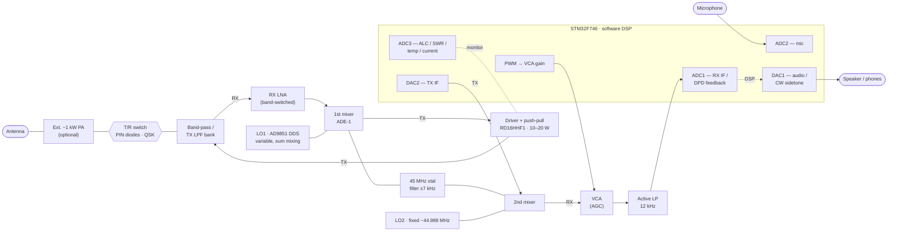

# LA7LKA QRP SDR Transceiver

A QRP transceiver built around an STM32F746 doing the demodulation in software,
with FreeDV digital voice integrated alongside the analog modes rather than
bolted on as an external adaptor.

Work in progress. Expect rapid changes, refactoring and experimental branches.

## Status — 2026-07-24

Working and tested against live signals:

| Mode | Status | Notes |
| --- | --- | --- |
| SSB (USB/LSB) | RX + TX working | Phasing method; sideband labelled to match the air after up-conversion (checked against an FT-857D) |
| NBFM | RX working | TX exists but is currently out of the main loop |
| **FreeDV 1600** | **RX + TX working** | HF, carried on SSB |
| **FreeDV 2400B** | **RX + TX working** | VHF/10 m, carried on FM |
| **FreeDV 700D** | **RX + TX working** | HF, weak-signal OFDM + LDPC |
| **FreeDV 700E** | **RX + TX working** | As 700D with a shorter frame, so it reacquires faster |
| **AM** | **RX + TX working** | Envelope detection in, carrier + both sidebands out |
| **CW** | **RX working** | SSB into a 250 Hz filter at 700 Hz, 5.3 ms blocks |
| **CW transmit** | **working** | Shaped keying, beacon on DAC1 |
| **SSB transmit** | **working** | Phasing method; unwanted sideband below the bench noise floor |
| **NBFM transmit** | **working** | Deviation set by mic gain, reported in telemetry |


Resource use with all four FreeDV modes compiled in: **227 KB flash of
1024 KB**, **231 KB RAM of 320 KB**, leaving about 14 KB of heap headroom.

## Architecture

### Signal chain overview

The whole Mk2 radio in one block diagram, both directions. The DSP core sits in
the middle; everything analog hangs off its two IF ports — ADC1 in, DAC2 out —
and the shared 45 MHz → 12 kHz chain is bidirectional, so the same first mixer
and 45 MHz crystal filter serve receive and transmit, selected by the T/R switch.



Trace the `RX` edges for receive — antenna → T/R → band filter → LNA → first
mixer → 45 MHz crystal filter → second mixer → VCA (AGC) → active low-pass →
ADC1 → DSP → DAC1 → audio — and the `TX` edges for transmit: mic → ADC2 → DSP →
DAC2 up through the same mixers and filter → driver and push-pull PA → LPF → T/R
→ antenna, optionally into an external ~1 kW PA. The third ADC monitors ALC, SWR,
temperature and current; during transmit ADC1 is idle and is reused for
predistortion feedback, mirroring how DAC1's receive audio path carries the CW
sidetone on transmit. Both converter reuses fall out of the radio being
half-duplex.

### The 12 kHz IF is the interface

The firmware ingests **one real ADC channel carrying a 12 kHz IF**, and does
not care how that IF was produced. Everything above it — mixing, filtering,
demodulation, FreeDV — is the same regardless of the front end.

That makes two builds possible from one codebase:

| | Mk1 | Mk2 |
| --- | --- | --- |
| Front end | Minimal, or none at all | Triple conversion |
| Signal source | GNU Radio, a cheap SDR, or a sound card | Antenna |
| Strong-signal performance | Modest | Roofing filter, good dynamic range |
| Hardware needed | Breadboard | PCB, shielding, alignment |
| Firmware | **Identical** | **Identical** |

Mk1 exists so the project can be reproduced and developed without a board, and
it is also the sensible build order: get the DSP and FreeDV chain solid against
a known-clean signal first, then take on the analog design knowing the firmware
side is already verified.

12 kHz is also exactly Fs/4 at 48 kHz sampling, which is convenient — the
complex mixer collapses to sign flips and I/Q swaps if it ever needs optimising.

### Mk1 — minimal front end

Any source that delivers a 12 kHz IF works. The GNU Radio flowgraphs in
[GNURadio/](GNURadio/README.md) generate one directly, so the entry cost is a
sound card output and a bias network to shift its swing into the ADC's 0–3.3 V
range centred on 1.65 V. No PCB, no alignment, no mixers.

### Mk2 — up-converting front end

Double conversion: up to a 45 MHz first IF, then straight down to the 12 kHz IF
the firmware ingests.

```
RF --> 30 MHz LP --> band-pass bank --> ADE-1 mixer --> 45 MHz xtal (±7 kHz) --> 2nd mixer --> 12 kHz --> active LP --> ADC (48 kHz)
```

Up-converting to 45 MHz first is what makes image rejection easy: a single
conversion to a low IF would put the image only twice the IF away — 910 kHz on
20 m — needing a tracking preselector with an impossible Q, which is exactly why
general-coverage receivers went to up-conversion.

The first mixer runs **sum mixing** with the LO on the low side, `LO1 = IF − RF`,
rather than the more usual `LO1 = RF + IF`. That is the key to using a cheap DDS:
LO1 then tunes only **16.5–43.1 MHz** across 160–10 m, comfortably inside an
AD9851's clean range and well under its ~70 MHz ceiling, so it covers all of HF
including 10 m. The wanted sum lands at 45 MHz; the image sits at `2 × IF − RF` =
**60–88 MHz**, up in VHF where the 30 MHz input low-pass and the band-pass bank
annihilate it. Two quirks come with sum mixing, both minor: tuning inverts (dial
up means DDS down, a one-line flip in `set frequency`), and the half-IF point at
`RF = 22.5 MHz` has LO1 = RF — not an amateur band, and handled by mixer balance
and the band-pass bank.

#### Band-pass filter bank

Up-conversion's own weakness is that it leaves the front end wideband: without
a preselector the first mixer sees the entire HF spectrum at once, including
broadcast stations tens of dB stronger than any amateur signal. Switched
per-band filters restore selectivity ahead of the mixer, and that is what
separates a good up-converting receiver from a mediocre one. It also helps the
30 MHz input low-pass dispose of the 60–88 MHz image band, since a filter centred
on an amateur band has enormous attenuation up there.

Six filters cover all ten HF bands, every one with a bandwidth ratio well under
2:1, so simple 3–5 pole LC sections are enough:

| Filter | Bands | Range |
| --- | --- | --- |
| 1 | 160 m | 1.81–2.00 MHz |
| 2 | 80 m | 3.50–3.80 MHz |
| 3 | 60 + 40 m | 5.35–7.20 MHz |
| 4 | 30 + 20 m | 10.10–14.35 MHz |
| 5 | 17 + 15 m | 18.07–21.45 MHz |
| 6 | 12 + 10 m | 24.89–29.70 MHz |

Relay switching is preferable to PIN diodes here: the whole point of the filter
bank is dynamic range, and diode bias current is one more thing that can
generate intermodulation. At QRP power the same bank can plausibly serve
transmit harmonic filtering as well, which halves the parts count — worth
deciding early, since it affects the relay and layout choice.

Only **two LOs** are needed, and only the first one tunes:

| LO | Frequency | Role |
| --- | --- | --- |
| LO1 | 16.5–43.1 MHz, variable (AD9851 DDS) | RF to 45 MHz, sum mixing |
| LO2 | 44.988 MHz, fixed | 45 MHz to 12 kHz |

Going from 45 MHz to a 12 kHz second IF in one step — with no 455 kHz stage in
between — works because the **45 MHz crystal filter does double duty**. A
ready-made ±7 kHz (14 kHz) crystal filter is both the roofing filter and the
image filter for the second conversion: that conversion's image sits `2 × 12 kHz`
= 24 kHz from the wanted 45 MHz signal, about 17 kHz into the filter's stopband,
so it is rejected by 60 dB or more. The old 455 kHz IF existed only for analog
selectivity, and this radio does selectivity in DSP, so it earns nothing here.
The 14 kHz passband is now the DSP's entire window, which covers CW, SSB, AM and
all the FreeDV modes; 2400B at 2.5 kHz deviation is about 11 kHz occupied and
fits too.

LO1 is an **AD9851 DDS** rather than a Si5351: it gives a clean sine suited to the
ADE-1 diode ring mixer, and better close-in phase noise than a fractional-N part.
That matters because **LO1 phase noise sets close-in dynamic range** — its noise
sidebands reciprocal-mix strong nearby signals straight into the IF, and on a
crowded band that, not the roofing filter, is the limit. It is the one place where
a cheap part would undo the reason for the whole architecture. LO2 is fixed, so a
crystal oscillator or a single Si5351 output does fine there. The AD9851 needs an
MMIC buffer to reach the +7 dBm the ADE-1 wants (its output is around 0 dBm), and
its known weakness is spurs — birdies that move with tuning — mitigated, though
not erased, by the band-pass bank.

LO control and band selection belong behind one thin hardware abstraction so
the core stays shared. A single `set frequency` entry point works out which
band the frequency falls in, selects the filter, and programs LO1; Mk1
implements it as a no-op or a single output, and the DSP layer never knows the
difference.

### DSP

Everything runs at 48 kHz from a TIM6-triggered ADC into a circular DMA buffer.
The main loop processes half a buffer at a time; the DMA callbacks only set a
flag.

Block size is chosen per mode, because the requirements genuinely differ:

| Mode | Block | Period | Why |
| --- | --- | --- | --- |
| FreeDV 1600 | 1920 | 40 ms | 1920/6 = 320 = exactly one FDMDV frame |
| FreeDV 2400B | 1920 | 40 ms | Exactly one fmfsk frame |
| FreeDV 700D/E | 1920 | 40 ms | Frames are 160/80 ms and do not fit a block; see below |
| Analog | 256 | 5.3 ms | Low enough latency for CW break-in |

Making a block equal exactly one modem frame matters more than it looks. With a
mismatched block size the per-block cost alternates between cheap and expensive,
and the expensive one overruns the period even when average load is well under
100 %.

All of this lives in one `mode_cfg[]` table in `main.c`, indexed by mode, so a
front panel menu can drive it and adding a mode is one row rather than edits in
five places.

### Buffered modes: the DMA ring is the input FIFO

700D cannot use the one-block-per-frame trick. Its frame is 160 ms and its OFDM
sync search costs well over 100 ms, so no block period can contain it — and a
15360-sample block would need 430 KB of RAM.

Its *average* load, though, is only about 28 %: one frame every 160 ms costing
roughly 45 ms. The problem was never the MCU, it was processing straight off
the DMA half-buffer, which forces every block to finish inside one block
period.

So for the buffered modes the ADC DMA buffer doubles as the input FIFO. It is
five blocks deep (200 ms) and holds halfword samples since the ADC is 12-bit;
the DMA writes continuously and the DSP reads behind it using the transfer
counter. There is no ISR work and no second copy of the data, and a slow frame
drains the ring instead of losing samples. codec2's own SM1000 port takes the
same approach with an explicit FIFO, which is what pointed the way — it runs
700D on a slower STM32F405.

Peak load may exceed the block period; only the average has to keep up. The
telemetry reflects that: `load_pct` above 100 is expected, and `ring` and `ovr`
are what actually matter.

Analog modes keep the direct path, since latency rather than throughput is what
CW break-in cares about. Which path a mode uses is a column in `mode_cfg[]`.

### FreeDV signal paths

The two modes take different routes through the radio, which is the point of
having both:

- **1600** is an HF mode carried on SSB. Its modem runs at 8 kHz, so the SSB
  audio is decimated 48k->8k, demodulated, and the decoded speech interpolated
  back to 48 kHz for the DAC.
- **2400B** is designed to pass through a commodity FM radio's audio path. Its
  modem runs at 48 kHz natively, so the FM discriminator output goes straight
  in with no resampling. Only the speech output is interpolated.

Note that 2400**A** is *not* the FM mode despite the name — it targets SDR
radios with 5 kHz RF bandwidth and needs about 75 KB of heap against 2400B's
8 KB.

The FM path for 2400B uses a dedicated discriminator with no de-emphasis and no
voice AGC. The voice FM demodulator's 500 us de-emphasis rolls off 11.8 dB at
1200 Hz and 23.6 dB at 4800 Hz, which tilts a data waveform badly across its own
band.

### T/R switching and QSK

The antenna transmit/receive switch is built from **PIN diodes, not a relay**,
and the reason is CW. Full break-in (QSK) means switching transmit→receive→
transmit inside the gap between two CW elements — and at speed that gap is short.
The element length in milliseconds is `1200 / WPM`, and the inter-element gap is
one element:

| WPM | Element = gap | Relay (~10 ms × 2 transitions) | PIN (~5 µs × 2) |
| --- | --- | --- | --- |
| 30 | 40 ms | 20 ms of receive left | 40 ms |
| 40 | 30 ms | 10 ms left | 30 ms |
| 50 | 24 ms | 4 ms left | 24 ms |
| 60 | 20 ms | **nothing — gap fully consumed** | 20 ms |

A mechanical relay takes milliseconds per transition, so two transitions eat a
large fraction of the gap; by 60 WPM they consume all of it and QSK is physically
impossible. A PIN diode switches in microseconds — under 0.03 % of even a 20 ms
gap — so the whole gap stays usable receive time. Relays also cannot be
*hot-switched* at power without arcing and contact wear, which would force an
extra RF-mute window that steals still more of the gap, and per-element switching
at 40 WPM is thousands of operations a minute, a mechanical lifetime in weeks. So
for high-speed CW, PIN is not merely better — the relay is ruled out by physics.

This is a *different* switch from the band-pass filter bank, which does use
relays: there, diode bias current is one more intermodulation source and dynamic
range is the priority, and the bank never switches per-element. Different job,
opposite trade-off.

Because the firmware owns transmit timing, it drives the PIN bias directly — no
relay settle or contact bounce to wait out — so it can **soft-key** the bias to
suppress key clicks and sequence bias→RF→bias deterministically per element. The
one thing that has to be right is the series transmit-path PIN's bias: it carries
the full RF and must stay hard-biased (a proper HF power PIN with long carrier
lifetime) or it adds its own IMD to the exciter. QSK also puts a requirement back
on the AGC — the receiver has to recover between dits, so CW needs a fast AGC
recovery mode rather than the slow release that suits ordinary CW.

The exciter feeding this is a **push-pull pair of RD16HHF1** at roughly 10–20 W,
chosen over the cheaper IRF510 because the IRF510 falls off at 28 MHz and 10 m
matters. That level is also enough to drive an external ~1 kW solid-state PA,
where a PIN-diode QSK module (Ameritron QSK-style) does the same job at
legal-limit power.

## Flashing a prebuilt image

If you just want to try it, `firmware/` holds a prebuilt image so you do not
need an ARM toolchain at all:

```sh
st-flash --format ihex write firmware/qrp-sdr-trx.hex
minicom -D /dev/ttyACM0 -b 115200
```

See [firmware/README.md](firmware/README.md) for what is in that build.

## Building

```sh
make
```

Requires `arm-none-eabi-gcc`.

### codec2 prerequisite

codec2 comes in as a git submodule, pinned to a known-good commit — the build
depends on generated sources and on API details that have moved between
versions, so the pin is deliberate.

```sh
git clone --recursive https://github.com/LA7LKA/SDR-TRX.git
```

or, if you already cloned without `--recursive`:

```sh
git submodule update --init
```

Then build codec2 once. The firmware consumes the generated codebook sources
from `codec2/build/src/` along with the generated `config.h` and `version.h`,
so this step is required even though we never link libcodec2 itself:

```sh
cd codec2 && mkdir -p build && cd build && cmake .. && make
```

### Build flags that matter

Getting codec2 to run in real time on this part needed several non-obvious
settings, all in the Makefile:

| Flag | Why |
| --- | --- |
| `-D__EMBEDDED__` | Drops `MODEM_STATS`'s GUI scatter-plot buffer. `struct freedv` goes from 140 KB to 480 B — without it `freedv_open()` cannot allocate at all. Also switches codec2 to `codec2_malloc`/`codec2_free`, provided in `freedv_chain.c`. |
| `-DFREEDV_MODE_EN_DEFAULT=0` plus per-mode enables | Building every mode overflows flash; the OFDM modes' LDPC matrices alone are hundreds of KB. |
| `-fsingle-precision-constant` (codec2 only) | The FPU is `fpv5-sp-d16`, single precision only. Unsuffixed literals promote expressions to `double`, which is then emulated in software. This removed 830 of 957 soft-float calls. |
| `-O3` (codec2 only) | The project builds at `-Og` for debuggability. A modem that has to keep up with real time does not benefit from that. |
| `-D__FPU_PRESENT=1` (codec2 only) | `codec2_math_arm.c`, which the OFDM modes need for `codec2_complex_dot_product_f32`, includes `arm_math.h` without a device header first, so the FPU would otherwise look absent. |

The OFDM modes also need `codec2/src/codec2_math_arm.c` in the source list;
without it `ofdm.c` will not link.

One trap worth knowing about if you are short of RAM: `run_ldpc_decoder()`
allocates roughly 32 KB across some 340 blocks **on every call**, not once at
open time. Starve the heap and its `CALLOC` returns NULL, `assert()` fires, and
`abort()` ends up in the `while (1)` inside newlib's `_exit()` — the board just
stops, with no output and no fault message. Budget for the transient, not only
for what `freedv_open()` reports.

Also required, in `main.c`: `SCB_EnableICache()`, plus `ART_ACCELERATOR_ENABLE`
and `PREFETCH_ENABLE` in `stm32f7xx_hal_conf.h`. At 216 MHz flash runs with 7
wait states, so without them every instruction fetch stalls and the DSP loop
runs several times slower than it should.

Stack and heap in `STM32F746XX_FLASH.ld` are raised well above the CubeMX
defaults: `fdmdv_demod()` puts variable-length arrays on the stack, and codec2
allocates its modem state with `malloc()`.

One more that is easy to miss: the chain calls `freedv_set_squelch_en(fdv, true)`.
With squelch off, codec2 passes the modem input through while unsynced by taking
every Nth sample with no anti-alias filter, which at 48 kHz in and 8 kHz out
folds everything above 4 kHz into the speech band and sounds like badly
resampled audio.

## Console

Commands over the same ST-Link VCP as the telemetry, so modes and transmit can
be driven without reflashing. Deliberately built before the front panel: an
OLED and switches then become a second way to reach commands that already work,
rather than a second thing to debug at the same time as transmit.

```
> mode          list modes
> mode 8        select by number
> tx            key the CW beacon
> rx            back to receive
> mic 15        microphone gain
> amtone        AM 1 kHz test tone, to prove the modulator without a mic
> wpm 25        CW speed
> stat          current state
```

## Telemetry

One line per second on USART3, which is the ST-Link virtual COM port
(`/dev/ttyACM0`), 115200 8N1:

```
mode=4 blocks=25 ovr=0 load_pct=57 us_max=23019 us_fdv=13663 adc_x1000=733 peak_x1000=104 rms_x1000=31 sync=1 snr_x10=57
```

| Field | Meaning |
| --- | --- |
| `blocks` / `ovr` | Blocks processed and overruns per second. `ovr` must be 0 — FreeDV cannot hold sync through gaps in the sample stream. |
| `load_pct` / `us_max` | DWT-measured worst-case block time against the block period. |
| `us_fdv` | Of that, how much was inside the FreeDV chain. |
| `adc_x1000` | Peak at the ADC, x1000. |
| `peak_x1000` / `rms_x1000` | Peak and RMS at the modem input. In FM modes a peak near 1000 means the discriminator is at the +-pi wrap point, i.e. the deviation is far too high. |
| `sync` / `snr_x10` | Modem sync and SNR estimate. SNR is not comparable between modes — the estimators differ. |

This is the main debugging instrument for the receive path.

## Bench setup

Signals are generated with GNU Radio on a PC rather than off the air:

- **1600**: mixed with a 12 kHz LO so the FDMDV carriers land at 12.9–14.1 kHz,
  and the firmware's NCO brings them back to 900–2100 Hz audio.
- **2400B**: fed to an FM modulator at **about 2.5 kHz deviation**. This matters
  — at 10x that, the discriminator sits at the wrap point and every wrap is an
  audible click.

Ready-to-run GNU Radio 3.10 flowgraphs for both are in
[GNURadio/](GNURadio/README.md).

## Roadmap

- Mk1 minimal front end, so the radio can be built without a PCB
- Programmable LO (AD9851 on I2C1), switched band-pass filter bank and VFO
  logic, behind a hardware abstraction so Mk1 and Mk2 keep sharing one core
- CW pitch and bandwidth as front panel controls; the filter is a biquad
  cascade rather than a FIR so retuning is five coefficients, not a redesign
- CW offset and sidetone, which must track the pitch: a tone heard at 700 Hz
  means the carrier is 700 Hz off the dial, and the sidetone has to match the
  RX pitch or zero-beating lands you beside the other station
- CW iambic keyer
- FreeDV TX
- Full filterbank (FIR/FFT), improved AGC and noise reduction
- PA control and protection logic
- CAT control
- Waterfall/spectrum display

### Further out: M17

M17 is an open digital voice protocol built on Codec2, so most of the hard part
here — getting Codec2 to run in real time on this MCU — is already done. Its
vocoder mode costs almost nothing to add:

| | Flash | RAM |
| --- | --- | --- |
| Current (1600 + 2400B) | 101 264 B | 228 588 B |
| Enabling `CODEC2_MODE_3200_EN` | 104 508 B | 228 588 B |
| **Difference** | **+3 244 B** | **0 B** |

3200 shares `sine`, `nlp`, `lpc` and `quantise` with 1300; only the
quantisation path differs.

M17's 40 ms frame is 1920 samples at 48 kHz, which is exactly the block size
the FreeDV modes already use, so the per-mode block machinery fits unchanged.
What is missing is the protocol layer: an RRC matched filter, symbol timing
recovery at 4800 sym/s, a Viterbi decoder for the K=5 rate-1/2 convolutional
code, and M17 framing. `libm17` exists as an embeddable C reference, and
OpenRTX already runs M17 on an STM32F405 at 168 MHz, so an F746 with the
instruction cache enabled has room to spare.

The natural target for M17 is VHF/UHF rather than HF, which would mean a third
front end alongside Mk1 and Mk2 — and a much simpler one, since image rejection
on a single narrow band does not need up-conversion. The 12 kHz IF interface
means the DSP core would not change.

## Licensing

This project is licensed under the **GNU General Public License v3.0** — see
[LICENSE](LICENSE).

codec2 remains under its own licence, LGPL 2.1, and is not redistributed here.
LGPL 2.1 permits linking from a GPL-licensed program, so the combination is
fine; the FSF licence compatibility list is the reference if you need the
detail.

If you redistribute a built image such as the one in `firmware/`, note that
linking LGPL code statically carries a relink obligation: a recipient has to be
able to rebuild the firmware against their own copy of codec2. The sources and
Makefile here are meant to cover that.

None of the above is legal advice.

## A note on how this was built

Substantial parts of the firmware, and most of the codec2 integration, were
written with AI assistance (Claude). The RF architecture, hardware, IF plan and
all on-air testing are mine, as are several of the corrections that made it
work. Worth stating openly rather than not.

73 de LA7LKA
