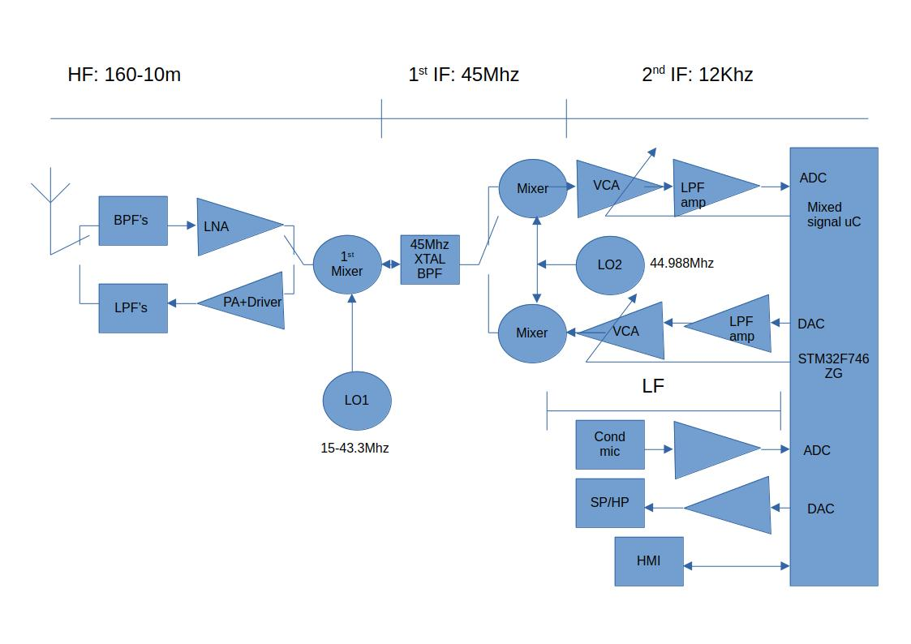

# Architecture

## Signal chain overview

The whole Mk2 radio in one block diagram, both directions. The DSP core sits in
the middle; everything analog hangs off its two IF ports — ADC1 in, DAC2 out —
and the shared 45 MHz → 12 kHz chain is bidirectional, so the same first mixer
and 45 MHz crystal filter serve receive and transmit, selected by the T/R switch.



For receive, follow the chain up: antenna → RX band-pass bank → LNA → 1st
mixer (driven by LO1) → 45 MHz crystal filter → 2nd mixer (driven by LO2,
fixed ~44.988 MHz) → VCA → low-pass amp → ADC → the STM32F746ZG → DAC → output
low-pass amp → speaker/phones. Transmit runs the same chain in the other
direction: conditioned mic input → ADC → the STM32F746ZG → DAC → VCA → the
same two mixers and crystal filter → driver and push-pull PA → TX low-pass
bank → antenna.

Two things the diagram leaves out on purpose, to keep it readable, and covers
here instead:

- **T/R switching.** The RX and TX paths share one antenna, switched by PIN
  diodes rather than a relay, for QSK — see
  [T/R switching and QSK](#tr-switching-and-qsk) below.
- **AGC/ALC and monitoring.** The two VCAs shown are one dual part (THAT2162):
  section 1 is RX AGC, section 2 is TX ALC, both driven by the MCU over PWM. A
  third ADC (not drawn) scans ALC, SWR, PA temperature and supply current; the
  RX-IF ADC is reused for DPD feedback during transmit, the same way the
  receive-audio DAC carries the CW sidetone on transmit — both reuses fall out
  of the radio being half-duplex.

## The 12 kHz IF is the interface

The firmware ingests **one real ADC channel carrying a 12 kHz IF**, and does
not care how that IF was produced. Everything above it — mixing, filtering,
demodulation, FreeDV — is the same regardless of the front end.

That makes two builds possible from one codebase:

| | Mk1 | Mk2 |
| --- | --- | --- |
| Front end | Minimal, or none at all | Triple conversion |
| Signal source | GNU Radio, a cheap SDR, or a sound card | Antenna |
| Strong-signal performance | Modest | Roofing filter, good dynamic range |
| Hardware needed | Breadboard | PCB, shielding, alignment |
| Firmware | **Identical** | **Identical** |

Mk1 exists so the project can be reproduced and developed without a board, and
it is also the sensible build order: get the DSP and FreeDV chain solid against
a known-clean signal first, then take on the analog design knowing the firmware
side is already verified.

12 kHz is also exactly Fs/4 at 48 kHz sampling, which is convenient — the
complex mixer collapses to sign flips and I/Q swaps if it ever needs optimising.

## Mk1 — minimal front end

Any source that delivers a 12 kHz IF works. The GNU Radio flowgraphs in
[firmware/GNURadio/](../firmware/GNURadio/README.md) generate one directly, so the entry cost is a
sound card output and a bias network to shift its swing into the ADC's 0–3.3 V
range centred on 1.65 V. No PCB, no alignment, no mixers.

## Mk2 — up-converting front end

Double conversion: up to a 45 MHz first IF, then straight down to the 12 kHz IF
the firmware ingests.

```
RF --> 30 MHz LP --> band-pass bank --> ADE-1 mixer --> 45 MHz xtal (±7 kHz) --> 2nd mixer --> 12 kHz --> active LP --> ADC (48 kHz)
```

Up-converting to 45 MHz first is what makes image rejection easy: a single
conversion to a low IF would put the image only twice the IF away — 910 kHz on
20 m — needing a tracking preselector with an impossible Q, which is exactly why
general-coverage receivers went to up-conversion.

The first mixer runs **sum mixing** with the LO on the low side, `LO1 = IF − RF`,
rather than the more usual `LO1 = RF + IF`. That is the key to using a cheap DDS:
LO1 then tunes only **16.5–43.1 MHz** across 160–10 m, comfortably inside an
AD9851's clean range and well under its ~70 MHz ceiling, so it covers all of HF
including 10 m. The wanted sum lands at 45 MHz; the image sits at `2 × IF − RF` =
**60–88 MHz**, up in VHF where the 30 MHz input low-pass and the band-pass bank
annihilate it. Two quirks come with sum mixing, both minor: tuning inverts (dial
up means DDS down, a one-line flip in `set frequency`), and the half-IF point at
`RF = 22.5 MHz` has LO1 = RF — not an amateur band, and handled by mixer balance
and the band-pass bank.

### Band-pass filter bank

Up-conversion's own weakness is that it leaves the front end wideband: without
a preselector the first mixer sees the entire HF spectrum at once, including
broadcast stations tens of dB stronger than any amateur signal. Switched
per-band filters restore selectivity ahead of the mixer, and that is what
separates a good up-converting receiver from a mediocre one. It also helps the
30 MHz input low-pass dispose of the 60–88 MHz image band, since a filter centred
on an amateur band has enormous attenuation up there.

Six filters cover all ten HF bands, every one with a bandwidth ratio well under
2:1, so simple 3–5 pole LC sections are enough:

| Filter | Bands | Range |
| --- | --- | --- |
| 1 | 160 m | 1.81–2.00 MHz |
| 2 | 80 m | 3.50–3.80 MHz |
| 3 | 60 + 40 m | 5.35–7.20 MHz |
| 4 | 30 + 20 m | 10.10–14.35 MHz |
| 5 | 17 + 15 m | 18.07–21.45 MHz |
| 6 | 12 + 10 m | 24.89–29.70 MHz |

Relay switching is preferable to PIN diodes here: the whole point of the filter
bank is dynamic range, and diode bias current is one more thing that can
generate intermodulation. At QRP power the same bank can plausibly serve
transmit harmonic filtering as well, which halves the parts count — worth
deciding early, since it affects the relay and layout choice.

Only **two LOs** are needed, and only the first one tunes:

| LO | Frequency | Role |
| --- | --- | --- |
| LO1 | 16.5–43.1 MHz, variable (AD9851 DDS) | RF to 45 MHz, sum mixing |
| LO2 | 44.988 MHz, fixed | 45 MHz to 12 kHz |

Going from 45 MHz to a 12 kHz second IF in one step — with no 455 kHz stage in
between — works because the **45 MHz crystal filter does double duty**. A
ready-made ±7 kHz (14 kHz) crystal filter is both the roofing filter and the
image filter for the second conversion: that conversion's image sits `2 × 12 kHz`
= 24 kHz from the wanted 45 MHz signal, about 17 kHz into the filter's stopband,
so it is rejected by 60 dB or more. The old 455 kHz IF existed only for analog
selectivity, and this radio does selectivity in DSP, so it earns nothing here.
The 14 kHz passband is now the DSP's entire window, which covers CW, SSB, AM and
all the FreeDV modes; 2400B at 2.5 kHz deviation is about 11 kHz occupied and
fits too.

LO1 is an **AD9851 DDS** rather than a Si5351: it gives a clean sine suited to the
ADE-1 diode ring mixer, and better close-in phase noise than a fractional-N part.
That matters because **LO1 phase noise sets close-in dynamic range** — its noise
sidebands reciprocal-mix strong nearby signals straight into the IF, and on a
crowded band that, not the roofing filter, is the limit. It is the one place where
a cheap part would undo the reason for the whole architecture. LO2 is fixed, but
it is a **second AD9851** rather than a plain crystal or a Si5351: LO2 drift maps
1:1 onto the 12 kHz IF centre, so a garden-variety crystal there would need
TCXO-grade stability anyway, and a custom-frequency TCXO at an oddball
44.988 MHz is a slow, low-volume special order. A second AD9851 reuses LO1's
buffer amp, filter and driver code, and — the real win — lets both DDS chips
share one reference oscillator, so the whole radio needs only one precision
reference, at a standard frequency, rather than hunting down two. Each AD9851
needs an MMIC buffer to reach the +7 dBm the ADE-1 wants (its output is around
0 dBm), and its known weakness is spurs — birdies that move with tuning —
mitigated, though not erased, by the band-pass bank.

LO control and band selection belong behind one thin hardware abstraction so
the core stays shared. A single `set frequency` entry point works out which
band the frequency falls in, selects the filter, and programs LO1; Mk1
implements it as a no-op or a single output, and the DSP layer never knows the
difference.

## DSP

Everything runs at 48 kHz from a TIM6-triggered ADC into a circular DMA buffer.
The main loop processes half a buffer at a time; the DMA callbacks only set a
flag.

Block size is chosen per mode, because the requirements genuinely differ:

| Mode | Block | Period | Why |
| --- | --- | --- | --- |
| FreeDV 1600 | 1920 | 40 ms | 1920/6 = 320 = exactly one FDMDV frame |
| FreeDV 2400B | 1920 | 40 ms | Exactly one fmfsk frame |
| FreeDV 700D/E | 1920 | 40 ms | Frames are 160/80 ms and do not fit a block; see below |
| Analog | 256 | 5.3 ms | Low enough latency for CW break-in |

Making a block equal exactly one modem frame matters more than it looks. With a
mismatched block size the per-block cost alternates between cheap and expensive,
and the expensive one overruns the period even when average load is well under
100 %.

All of this lives in one `mode_cfg[]` table in `main.c`, indexed by mode, so a
front panel menu can drive it and adding a mode is one row rather than edits in
five places.

## Buffered modes: the DMA ring is the input FIFO

700D cannot use the one-block-per-frame trick. Its frame is 160 ms and its OFDM
sync search costs well over 100 ms, so no block period can contain it — and a
15360-sample block would need 430 KB of RAM.

Its *average* load, though, is only about 28 %: one frame every 160 ms costing
roughly 45 ms. The problem was never the MCU, it was processing straight off
the DMA half-buffer, which forces every block to finish inside one block
period.

So for the buffered modes the ADC DMA buffer doubles as the input FIFO. It is
five blocks deep (200 ms) and holds halfword samples since the ADC is 12-bit;
the DMA writes continuously and the DSP reads behind it using the transfer
counter. There is no ISR work and no second copy of the data, and a slow frame
drains the ring instead of losing samples. codec2's own SM1000 port takes the
same approach with an explicit FIFO, which is what pointed the way — it runs
700D on a slower STM32F405.

Peak load may exceed the block period; only the average has to keep up. The
telemetry reflects that: `load_pct` above 100 is expected, and `ring` and `ovr`
are what actually matter.

Analog modes keep the direct path, since latency rather than throughput is what
CW break-in cares about. Which path a mode uses is a column in `mode_cfg[]`.

## FreeDV signal paths

The two modes take different routes through the radio, which is the point of
having both:

- **1600** is an HF mode carried on SSB. Its modem runs at 8 kHz, so the SSB
  audio is decimated 48k->8k, demodulated, and the decoded speech interpolated
  back to 48 kHz for the DAC.
- **2400B** is designed to pass through a commodity FM radio's audio path. Its
  modem runs at 48 kHz natively, so the FM discriminator output goes straight
  in with no resampling. Only the speech output is interpolated.

Note that 2400**A** is *not* the FM mode despite the name — it targets SDR
radios with 5 kHz RF bandwidth and needs about 75 KB of heap against 2400B's
8 KB.

The FM path for 2400B uses a dedicated discriminator with no de-emphasis and no
voice AGC. The voice FM demodulator's 500 us de-emphasis rolls off 11.8 dB at
1200 Hz and 23.6 dB at 4800 Hz, which tilts a data waveform badly across its own
band.

## T/R switching and QSK

The antenna transmit/receive switch is built from **PIN diodes, not a relay**,
and the reason is CW. Full break-in (QSK) means switching transmit→receive→
transmit inside the gap between two CW elements — and at speed that gap is short.
The element length in milliseconds is `1200 / WPM`, and the inter-element gap is
one element:

| WPM | Element = gap | Relay (~10 ms × 2 transitions) | PIN (~5 µs × 2) |
| --- | --- | --- | --- |
| 30 | 40 ms | 20 ms of receive left | 40 ms |
| 40 | 30 ms | 10 ms left | 30 ms |
| 50 | 24 ms | 4 ms left | 24 ms |
| 60 | 20 ms | **nothing — gap fully consumed** | 20 ms |

A mechanical relay takes milliseconds per transition, so two transitions eat a
large fraction of the gap; by 60 WPM they consume all of it and QSK is physically
impossible. A PIN diode switches in microseconds — under 0.03 % of even a 20 ms
gap — so the whole gap stays usable receive time. Relays also cannot be
*hot-switched* at power without arcing and contact wear, which would force an
extra RF-mute window that steals still more of the gap, and per-element switching
at 40 WPM is thousands of operations a minute, a mechanical lifetime in weeks. So
for high-speed CW, PIN is not merely better — the relay is ruled out by physics.

This is a *different* switch from the band-pass filter bank, which does use
relays: there, diode bias current is one more intermodulation source and dynamic
range is the priority, and the bank never switches per-element. Different job,
opposite trade-off.

Because the firmware owns transmit timing, it drives the PIN bias directly — no
relay settle or contact bounce to wait out — so it can **soft-key** the bias to
suppress key clicks and sequence bias→RF→bias deterministically per element. The
one thing that has to be right is the series transmit-path PIN's bias: it carries
the full RF and must stay hard-biased (a proper HF power PIN with long carrier
lifetime) or it adds its own IMD to the exciter. QSK also puts a requirement back
on the AGC — the receiver has to recover between dits, so CW needs a fast AGC
recovery mode rather than the slow release that suits ordinary CW.

Mk2 is a **pure QRP rig, ~5 W out** — not sized to drive an external amplifier.
The exciter is an **RD16HHF1**, chosen over the cheaper IRF510 because the
IRF510 falls off at 28 MHz and 10 m matters; whether it stays push-pull (for
even-order harmonic cancellation ahead of the TX low-pass bank) or drops to a
single device now that the higher-power headroom isn't needed is still open.

